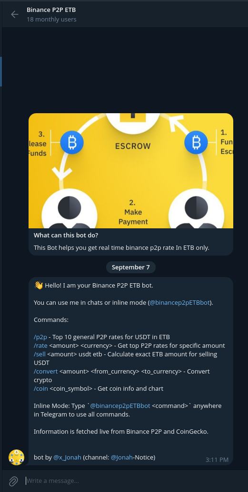

````markdown
# Binance P2P ETB Bot 🤖💱

[
[
[
{

A **Telegram bot** that provides real-time **Binance P2P rates**, **crypto conversions**, and **coin info** with charts, all in **ETB** or other currencies. Works in **inline mode** and in **groups**.  

🚀 Features

- `/start` – Shows all available commands and usage tips.  
- `/p2p` – Fetches the **top 10 general P2P rates** for USDT → ETB.  
- `/rate <amount> <currency>` – Get **P2P rates for a specific amount** in any fiat or crypto.  
- `/sell <amount> usdt etb` – Calculate **exact ETB you will receive** for selling USDT (picks reliable rates to avoid frozen offers).  
- `/convert <amount> <from_currency> <to_currency>` – Convert crypto based on CoinGecko data.  
- `/coin <coin_symbol>` – Fetch real-time info about any crypto coin with a **7-day price chart**.  
- Fully supports **inline mode**: users can call `@binancep2pETBbot` from anywhere in Telegram.  
- Group-friendly: works in **Telegram groups** without needing admin privileges (optional).  

📷 Demo

  
*Example showing `/sell 50 usdt etb` and `/coin BTC` outputs.*

---

## 💻 Installation

1. **Clone the repository**:  
```bash
git clone https://github.com/YonasGr/BinanceP2PtgBot.git
cd binance-p2p-etb-bot
````

2. **Create a virtual environment**:

```bash
python3 -m venv venv
source venv/bin/activate  # Linux/Mac
venv\Scripts\activate     # Windows
```

3. **Install dependencies**:

```bash
pip install -r requirements.txt
```

4. **Set environment variable** for Telegram bot token:

```bash
export TELEGRAM_BOT_TOKEN="YOUR_BOT_TOKEN"  # Linux/Mac
set TELEGRAM_BOT_TOKEN="YOUR_BOT_TOKEN"     # Windows
```

---

## ⚡ Usage

Run the bot locally with:

```bash
python main.py
```

Your bot will start polling for updates or can be configured with **webhooks** for PythonAnywhere deployment.

---

### Inline Mode Example

Type anywhere in Telegram:

```
@binancep2pETBbot sell 50 usdt etb
```

Bot will reply with **the best current ETB value** automatically.

---

## 🔧 Dependencies

* Python 3.13
* [python-telegram-bot](https://github.com/python-telegram-bot/python-telegram-bot)
* [Requests](https://docs.python-requests.org/)
* [Matplotlib](https://matplotlib.org/)
* [python-dotenv](https://github.com/theskumar/python-dotenv)

---

## ⚙️ Notes

* **Inline mode:** The bot works anywhere in Telegram if the user mentions `@binancep2pETBbot`.
* **Rate Selection:** The `/sell` command automatically skips unreliable top Binance P2P offers.
* **CoinGecko integration:** Supports **all cryptocurrencies** listed on CoinGecko for `/convert` and `/coin`.
